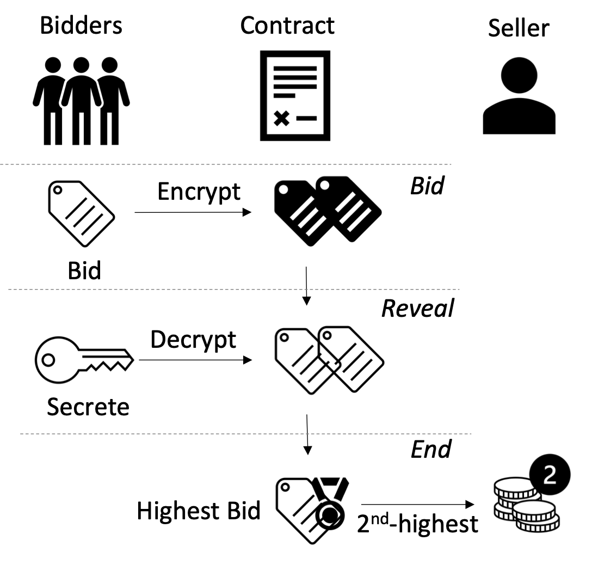

# Distributed Auction with Smart Contracts

Code for the CE7490 assignment 2 report  "Exploring Versatile Blockchain-based Auctions for real-world applications".


**Exploring Versatile Blockchain-based Auctions for real-world applications**

Team: Jiawei Ren, Jianyi Wang, Mingyuan Zhang


## Introduction

In this project, we implement several distributed auction models with [Solidity](https://docs.soliditylang.org/en/v0.8.17/):
<details open>
  <summary>English Auction</summary>
  
  - The price starts low and increases as buyers bid.
  - The auction continues until no higher bids are received.
  - Our implementation: [contracts/EnglishAuction.sol](contracts/EnglishAuction.sol)
  
</details>

<details>
  <summary>Dutch Auction</summary>
  
  - The auctioneer starts the auction with a high asking price.
  - The price is gradually reduced until one bidder accepts it.
  - Our implementation: [contracts/DutchAuction.sol](contracts/DutchAuction.sol)
  
</details>

<details>
  <summary>Blind Auction</summary>
  
  - All bidders simultaneously submit a sealed bid.
  - The highest bidder wins and pays his or her bid.
  - Our implementation: [contracts/BlindAuction.sol](contracts/BlindAuction.sol)
  
</details>

<details>
  <summary>Vickrey Auction</summary>
  
  - All bidders simultaneously submit a sealed bid.
  - The highest bidder still wins but only pays the second-highest bid.
  - Our implementation: [contracts/VickreyAuction.sol](contracts/VickreyAuction.sol)
  
</details>

<details>
  <summary>All-pay Auction</summary>
  
  - Every bidder must pay regardless of whether they win.
  - The auction is still awarded to the highest bidder.
  - Our implementation: [contracts/AllPayAuction.sol](contracts/AllPayAuction.sol)
  
</details>

We design a simulation test for each smart contract with [Hardhat](https://hardhat.org) to verify its correctness and analyze its gas cost.

## Code Structure
```
project
│   
└───contracts
│   │   EnglishAuction.sol
│   │   DutchAuction.sol
│   │   BlindAuction.sol
│   │   VickreyAuction.sol
│   └───AllPayAuction.sol
│   
└───test
    │   EnglishAuction.ts
    │   DutchAuction.ts
    │   BlindAuction.ts
    │   VickreyAuction.ts
    └───AllPayAuction.ts
```

- Smart contracts for various auction models are in [`contracts`](contracts).
- Simulation tests are in [`test`](test).

## Get Started

```shell
git clone git@github.com:jiawei-ren/CE7490-Assignment2.git
cd CE7490-Assignment2
npm init -y
npm install --save-dev hardhat 
```

## Run Simulation Test with Gas Report
```shell
REPORT_GAS=true npx hardhat test
```
Example result:


## Acknowledgement

The smart contracts for English Auction and Blind Auction are developed based on the [Solidity tutorial](https://docs.soliditylang.org/en/v0.8.17/solidity-by-example.html#blind-auction).